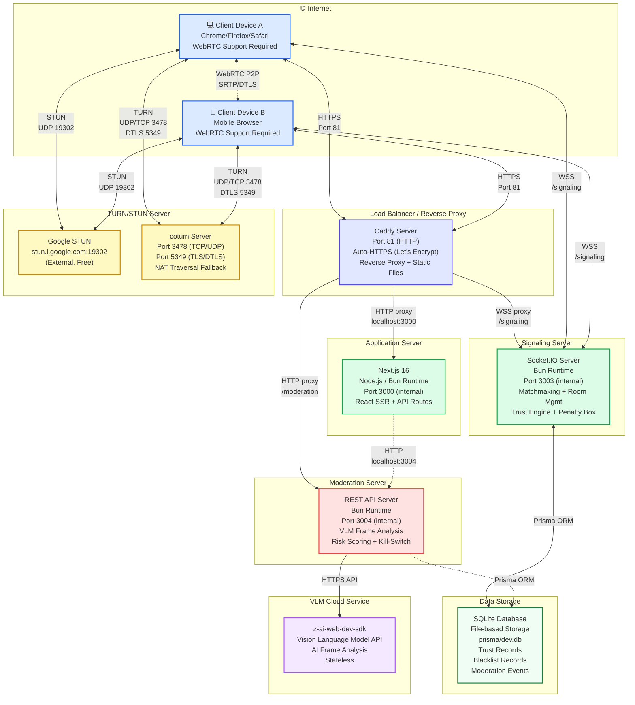
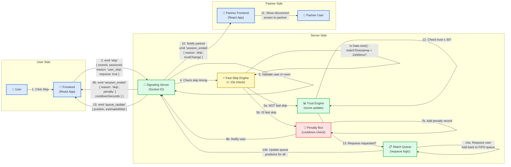

# SecureStream — UML Diagrams

> **Privacy-first, AI-moderated anonymous video chat platform**
>
> All diagrams rendered using Mermaid.js. This document covers use cases, class design, sequence flows, state machines, component architecture, deployment topology, database schema, communication patterns, and package organization.

---

## Table of Contents

1. [Use Case Diagram](#1-use-case-diagram)
2. [Class Diagram](#2-class-diagram)
3. [Sequence Diagram — Matchmaking + WebRTC Flow](#3-sequence-diagram--matchmaking--webrtc-flow)
4. [Sequence Diagram — AI Moderation Kill-Switch Flow](#4-sequence-diagram--ai-moderation-kill-switch-flow)
5. [Activity Diagram — User Session Flow](#5-activity-diagram--user-session-flow)
6. [State Machine Diagram — App Phase States](#6-state-machine-diagram--app-phase-states)
7. [Component Diagram](#7-component-diagram)
8. [Deployment Diagram](#8-deployment-diagram)
9. [Entity-Relationship Diagram (ERD)](#9-entity-relationship-diagram-erd)
10. [Communication Diagram — Skip Flow](#10-communication-diagram--skip-flow)
11. [Package Diagram](#11-package-diagram)

---

## 1. Use Case Diagram

```mermaid
flowchart TB
    subgraph Actors
        AU["👤 Anonymous User\n(Browser Client)"]
        AI["🤖 AI Moderation System\n(VLM + Risk Engine)"]
    end

    subgraph UC_Registration["Registration / Entry"]
        UC1("Start Chat")
        UC2("Grant Camera/Mic Permissions")
        UC3("Generate Session ID\n(UUID auto-generated)")
    end

    subgraph UC_Matchmaking["Matchmaking"]
        UC4("Join Queue")
        UC5("Leave Queue")
        UC6("View Queue Position\n& Estimated Wait")
    end

    subgraph UC_Video["Video Communication"]
        UC7("Start Video Session\n(WebRTC P2P)")
        UC8("End Video Session")
        UC9("Skip Partner")
        UC10("Mute / Unmute Audio")
        UC11("Toggle Camera On/Off")
    end

    subgraph UC_Text["Text Chat"]
        UC12("Send Text Message")
        UC13("Receive Text Message")
    end

    subgraph UC_Moderation["AI Moderation"]
        UC14("Capture Video Frame\n(128×96 JPEG)")
        UC15("Analyze Frame via VLM")
        UC16("Detect Violation\n(Risk Score Assessment)")
        UC17("Apply Kill-Switch\n(Terminate Session)")
        UC18("Show Warning Overlay\n(Blur + Alert)")
    end

    subgraph UC_Trust["Trust System"]
        UC19("View Trust Score")
        UC20("Apply Penalty\n(Fast-Skip Deduction)")
        UC21("Blacklist User\n(Trust ≤ 30)")
    end

    subgraph UC_Reporting["Reporting"]
        UC22("Report User")
        UC23("Receive Report\nAcknowledgment")
    end

    %% Actor to Use Case connections
    AU --> UC1
    AU --> UC2
    AU -.->|auto| UC3
    AU --> UC4
    AU --> UC5
    UC4 --> UC6
    AU --> UC7
    AU --> UC8
    AU --> UC9
    AU --> UC10
    AU --> UC11
    AU --> UC12
    AU -.-> UC13
    AU --> UC22
    AU -.-> UC23
    AU --> UC19

    %% Moderation system connections
    AI --> UC15
    AI --> UC16
    UC16 --> UC17
    UC16 --> UC18
    AI --> UC21

    %% Cross-connections
    UC14 -.-> UC15
    UC9 -.-> UC20
    UC20 -.-> UC21
    UC22 -.-> UC16

    %% Include/Extend annotations
    UC1 -.-|«include»| UC2
    UC2 -.-|«include»| UC3
    UC4 -.-|«include»| UC3
    UC7 -.-|«include»| UC4
    UC16 -.-|«extend»| UC17
    UC16 -.-|«extend»| UC18
    UC9 -.-|«extend»| UC20

    classDef actor fill:#4f46e5,stroke:#3730a3,color:#fff,font-weight:bold
    classDef uc_reg fill:#dbeafe,stroke:#3b82f6
    classDef uc_match fill:#dcfce7,stroke:#22c55e
    classDef uc_video fill:#fef9c3,stroke:#eab308
    classDef uc_text fill:#fce7f3,stroke:#ec4899
    classDef uc_mod fill:#fee2e2,stroke:#ef4444
    classDef uc_trust fill:#f3e8ff,stroke:#a855f7
    classDef uc_report fill:#ffedd5,stroke:#f97316

    class AU,AI actor
    class UC1,UC2,UC3 uc_reg
    class UC4,UC5,UC6 uc_match
    class UC7,UC8,UC9,UC10,UC11 uc_video
    class UC12,UC13 uc_text
    class UC14,UC15,UC16,UC17,UC18 uc_mod
    class UC19,UC20,UC21 uc_trust
    class UC22,UC23 uc_report
```



### Notes

| Actor | Description |
|-------|-------------|
| **Anonymous User** | End-user accessing SecureStream via a modern browser. No registration required. Identified only by an auto-generated UUID session ID. |
| **AI Moderation System** | Backend VLM (Vision Language Model) powered by `z-ai-web-dev-sdk`. Stateless — each frame analysis is independent. Never stores video data. |

| Group | Use Cases |
|-------|-----------|
| **Registration/Entry** | `Start Chat` includes `Grant Permissions` which includes `Generate Session ID`. Camera/mic access is mandatory. |
| **Matchmaking** | FIFO queue with position tracking. Users can leave at any time. |
| **Video Communication** | Full WebRTC P2P with audio/video controls. |
| **Text Chat** | Optional in-band text relayed via Socket.IO signaling. |
| **Moderation** | Frame capture every 2s → VLM analysis → risk scoring → action. Kill-switch terminates session on high risk. |
| **Trust System** | Score starts at 100. Penalties for violations. Auto-blacklist at ≤ 30. |
| **Reporting** | Users can report partners. Triggers trust deduction after moderation confirmation. |

---

## 2. Class Diagram

```mermaid
classDiagram
    direction TB

    %% ===== VideoChat (Main Frontend Component) =====
    class VideoChat {
        <<React Component>>
        -state: AppState
        -sessionId: string
        -socket: Socket
        -peerConnection: RTCPeerConnection | null
        -localStream: MediaStream | null
        -remoteStream: MediaStream | null
        -moderationInterval: NodeJS.Timer | null
        -heartbeatInterval: NodeJS.Timer | null
        +componentDidMount(): void
        +componentWillUnmount(): void
        +handleStart(): Promise~void~
        +handleFindNext(): void
        +handleGoHome(): void
        +handleSkip(): void
        +handleEndSession(): void
        +handleReport(reason: string): void
        +handleMuteToggle(): void
        +handleCameraToggle(): void
        +handleSendMessage(text: string): void
        +handleModerationResult(result: ModerationResponse): void
        +createPeerConnection(): RTCPeerConnection
        +handleOffer(offer: OfferPayload): void
        +handleAnswer(answer: AnswerPayload): void
        +handleIceCandidate(candidate: IceCandidatePayload): void
        +handleIceRestart(): void
        +startHeartbeat(): void
        +stopHeartbeat(): void
        +startModeration(): void
        +stopModeration(): void
        +captureFrame(): string
        +transitionTo(phase: AppPhase, data?: object): void
        +cleanupConnection(): void
        +cleanupAll(): void
    }

    %% ===== SignalingServer =====
    class SignalingServer {
        <<Socket.IO Server>>
        -io: Server
        -config: ServerConfig
        -matchQueue: MatchQueue
        -roomManager: RoomManager
        -trustEngine: TrustEngine
        -penaltyBox: PenaltyBox
        -blacklist: Blacklist
        -rateLimiter: RateLimiter
        +start(): void
        +stop(): void
        -setupEventHandlers(): void
        -handleConnection(socket: Socket): void
        -handleJoinQueue(socket: Socket, payload: JoinQueuePayload): Promise~void~
        -handleLeaveQueue(socket: Socket): void
        -handleOffer(socket: Socket, payload: OfferPayload): void
        -handleAnswer(socket: Socket, payload: AnswerPayload): void
        -handleIceCandidate(socket: Socket, payload: IceCandidatePayload): void
        -handleSkip(socket: Socket, payload: SkipPayload): void
        -handleReport(socket: Socket, payload: ReportPayload): void
        -handleHeartbeat(socket: Socket, payload: HeartbeatPayload): void
        -handleModerationFlag(socket: Socket, payload: ModerationFlagPayload): void
        -handleIceRestart(socket: Socket, payload: IceRestartPayload): void
        -handleDisconnect(socket: Socket): void
        -notifyPartner(sessionId: string, event: string, payload: object): void
        -getStats(): StatsResponse
        -startCleanupTimer(): void
    }

    %% ===== ModerationService =====
    class ModerationService {
        <<REST API Server>>
        -port: number
        -analyzer: FrameAnalyzer
        -riskScorer: RiskScorer
        -actionMapper: ActionMapper
        +start(): void
        +stop(): void
        -handleModerate(req: Request, res: Response): Promise~void~
        -handleHealthCheck(req: Request, res: Response): void
        -validateRequest(body: unknown): ModerationRequest
        -sanitizeFrame(frame: string): string
    }

    %% ===== Room =====
    class Room {
        +roomId: string
        +users: Map~string, RoomUser~
        +createdAt: number
        +matchTimestamp: number
        +addUser(user: RoomUser): void
        +removeUser(sessionId: string): RoomUser | undefined
        +getUser(sessionId: string): RoomUser | undefined
        +getPartner(sessionId: string): RoomUser | undefined
        +isFull(): boolean
        +isActive(): boolean
        +getDuration(): number
    }

    %% ===== RoomUser =====
    class RoomUser {
        +sessionId: string
        +socketId: string
        +joinedAt: number
        +lastHeartbeat: number
        +matchTimestamp: number
        +updateHeartbeat(): void
        +isStale(timeoutMs: number): boolean
    }

    %% ===== TrustEngine =====
    class TrustEngine {
        -prisma: PrismaClient
        -blacklistThreshold: number
        +getScore(sessionId: string): Promise~number~
        +updateScore(sessionId: string, change: number): Promise~TrustRecord~
        +checkThreshold(sessionId: string): Promise~boolean~
        +initScore(sessionId: string): Promise~TrustRecord~
        +resetScore(sessionId: string): Promise~TrustRecord~
        +getRecord(sessionId: string): Promise~TrustRecord | null~
    }

    %% ===== PenaltyBox =====
    class PenaltyBox {
        -penalties: Map~string, PenaltyRecord~
        +addPenalty(sessionId: string, fastSkipCount: number): PenaltyRecord
        +isInPenalty(sessionId: string): boolean
        +getPenalty(sessionId: string): PenaltyRecord | undefined
        +removePenalty(sessionId: string): void
        +cleanup(): number
        +getCooldownRemaining(sessionId: string): number
    }

    %% ===== MatchQueue =====
    class MatchQueue {
        -queue: Map~string, JoinRequest~
        +enqueue(request: JoinRequest): number
        +dequeue(): JoinRequest[] | null
        +dequeueUser(sessionId: string): JoinRequest | undefined
        +getPosition(sessionId: string): number
        +getSize(): number
        +contains(sessionId: string): boolean
        +clear(): void
        +updatePositions(): void
    }

    %% ===== Blacklist =====
    class Blacklist_ {
        -prisma: PrismaClient
        +check(sessionId: string): Promise~BlacklistRecord | null~
        +add(sessionId: string, reason: string): Promise~BlacklistRecord~
        +removeExpired(): Promise~number~
        +isBlacklisted(sessionId: string): Promise~boolean~
    }

    %% ===== RateLimiter =====
    class RateLimiter {
        -windows: Map~string, number[]~
        +checkRateLimit(sessionId: string, maxRequests: number, windowMs: number): boolean
        +clearLimits(sessionId: string): void
        +cleanup(): number
    }

    %% ===== RiskScorer =====
    class RiskScorer {
        <<Service>>
        +weights: RiskWeights
        +calculateRisk(analysis: VLMAnalysis): RiskScore
        +getRiskLevel(score: number): RiskLevel
    }

    %% ===== FrameAnalyzer =====
    class FrameAnalyzer {
        <<Service>>
        +analyzeFrame(frame: string): Promise~VLMAnalysis~
        -sendToVLM(frame: string, prompt: string): Promise~string~
        -parseVLMResponse(raw: string): VLMAnalysis
    }

    %% ===== ActionMapper =====
    class ActionMapper {
        <<Service>>
        +mapAction(riskLevel: RiskLevel, consecutiveViolations: number): ModerationAction
    }

    %% ===== Prisma Models =====
    class TrustRecord {
        <<Prisma Model>>
        +id: String «PK»
        +sessionId: String «unique»
        +score: Int «default: 100»
        +createdAt: DateTime
        +updatedAt: DateTime
        +blacklists: BlacklistRecord[]
        +modEvents: ModerationEvent[]
    }

    class BlacklistRecord {
        <<Prisma Model>>
        +id: String «PK»
        +sessionId: String «FK»
        +reason: String
        +expiresAt: DateTime
        +createdAt: DateTime
        +trustRecord: TrustRecord
    }

    class ModerationEvent {
        <<Prisma Model>>
        +id: String «PK»
        +sessionId: String «FK»
        +roomId: String
        +riskLevel: String
        +action: String
        +reasons: String «JSON»
        +createdAt: DateTime
        +trustRecord: TrustRecord
    }

    %% ===== Risk Weights / Score Value Types =====
    class RiskWeights {
        <<Value Object>>
        +nsfw: number «0.5»
        +noHuman: number «0.2»
        +bot: number «0.15»
        +multiFace: number «0.1»
        +objectionable: number «0.05»
    }

    class RiskScore {
        <<Value Object>>
        +composite: number
        +level: RiskLevel
        +action: ModerationAction
        +highRisk: boolean
    }

    class VLMAnalysis {
        <<Value Object>>
        +faceCount: number
        +humanPresent: boolean
        +nsfwScore: number
        +botScore: number
    }

    class PenaltyRecord {
        <<Value Object>>
        +sessionId: string
        +cooldownUntil: number
        +fastSkipCount: number
        +firstSkipTime: number
    }

    class JoinRequest {
        <<Value Object>>
        +sessionId: string
        +socketId: string
        +joinedAt: number
    }

    %% ===== Relationships =====
    %% SignalingServer composition
    SignalingServer *-- MatchQueue : owns
    SignalingServer *-- RoomManager : owns
    SignalingServer *-- TrustEngine : owns
    SignalingServer *-- PenaltyBox : owns
    SignalingServer *-- Blacklist_ : owns
    SignalingServer *-- RateLimiter : owns

    %% RoomManager composition (delegated via SignalingServer)
    RoomManager ..> Room : creates/manages
    RoomManager ..> RoomUser : tracks

    Room *-- RoomUser : contains 0..2

    %% ModerationService composition
    ModerationService *-- FrameAnalyzer : owns
    ModerationService *-- RiskScorer : owns
    ModerationService *-- ActionMapper : owns

    RiskScorer --> RiskWeights : uses
    RiskScorer --> RiskScore : produces
    FrameAnalyzer --> VLMAnalysis : returns

    %% TrustEngine to Prisma models
    TrustEngine --> TrustRecord : reads/writes
    TrustEngine --> BlacklistRecord : checks
    TrustEngine --> ModerationEvent : creates

    Blacklist_ --> TrustRecord : references
    Blacklist_ --> BlacklistRecord : reads/writes

    %% Prisma model relationships
    TrustRecord "1" --o "*" BlacklistRecord : has
    TrustRecord "1" --o "*" ModerationEvent : has

    %% Value object relationships
    MatchQueue --> JoinRequest : stores
    PenaltyBox --> PenaltyRecord : tracks

    %% Frontend associations
    VideoChat ..> SignalingServer : connects via Socket.IO
    VideoChat ..> ModerationService : calls REST API
    VideoChat ..> RTCPeerConnection : manages

    classDef component fill:#e0e7ff,stroke:#4f46e5,stroke-width:2px
    classDef service fill:#dbeafe,stroke:#2563eb
    classDef model fill:#dcfce7,stroke:#16a34a
    classDef value fill:#fef9c3,stroke:#ca8a04
    classDef prisma fill:#f0fdf4,stroke:#15803d,stroke-width:2px

    class VideoChat,SignalingServer,ModerationService component
    class FrameAnalyzer,RiskScorer,ActionMapper,TrustEngine,Blacklist_,RateLimiter service
    class Room,RoomUser,MatchQueue,PenaltyBox model
    class RiskWeights,RiskScore,VLMAnalysis,PenaltyRecord,JoinRequest value
    class TrustRecord,BlacklistRecord,ModerationEvent prisma
```

### Relationship Summary

| Relationship | Type | Description |
|-------------|------|-------------|
| `SignalingServer` → `MatchQueue` | **Composition** | Server owns and lifecycle-manages the queue |
| `SignalingServer` → `RoomManager` | **Composition** | Server owns room lifecycle management |
| `SignalingServer` → `TrustEngine` | **Composition** | Server owns trust score logic |
| `SignalingServer` → `PenaltyBox` | **Composition** | Server owns penalty enforcement |
| `SignalingServer` → `Blacklist` | **Composition** | Server owns blacklist enforcement |
| `SignalingServer` → `RateLimiter` | **Composition** | Server owns rate limiting |
| `Room` → `RoomUser` | **Composition** | Room contains 0–2 users |
| `ModerationService` → `FrameAnalyzer` | **Composition** | Service owns VLM analysis |
| `ModerationService` → `RiskScorer` | **Composition** | Service owns risk calculation |
| `ModerationService` → `ActionMapper` | **Composition** | Service owns action mapping |
| `TrustRecord` → `BlacklistRecord` | **1:Many** | One trust record has many blacklist entries |
| `TrustRecord` → `ModerationEvent` | **1:Many** | One trust record has many moderation events |
| `VideoChat` → `SignalingServer` | **Association** | Socket.IO WebSocket connection |
| `VideoChat` → `ModerationService` | **Association** | REST HTTP calls |

---

## 3. Sequence Diagram — Full Matchmaking + WebRTC Flow

```mermaid
sequenceDiagram
    actor UA as User A
    participant FA as Frontend A<br/>(React App)
    participant SS as Signaling Server<br/>(Port 3003)
    participant FB as Frontend B<br/>(React App)
    actor UB as User B

    rect rgb(219, 234, 254)
        note over UA,UB
            <b>Phase 1: Entry & Permission</b>
            Each user grants camera/mic and generates a session ID.
        end

        UA->>FA: Clicks "Start Anonymous Chat"
        FA->>FA: Generate UUID session ID
        FA->>FA: requestPermission()<br/>navigator.mediaDevices.getUserMedia()
        FA-->>UA: Camera permission prompt
        UA->>FA: Grants permission
        FA->>FA: Start local video preview (PiP)

        UB->>FB: Clicks "Start Anonymous Chat"
        FB->>FB: Generate UUID session ID
        FB->>FB: requestPermission()
        FB-->>UB: Camera permission prompt
        UB->>FB: Grants permission
        FB->>FB: Start local video preview (PiP)
    end

    rect rgb(220, 252, 231)
        note over UA,UB
            <b>Phase 2: Matchmaking</b>
            Both users join the FIFO queue and get paired.
        end

        FA->>SS: Socket.IO connect
        SS-->>FA: connection acknowledged

        FA->>SS: emit 'join_queue'<br/>{ sessionId }
        SS->>SS: Check blacklist<br/>Check penalty box<br/>Check rate limit
        SS->>SS: Add to MatchQueue
        SS-->>FA: emit 'queue_update'<br/>{ position: 1, estimatedWait: 5 }

        FB->>SS: Socket.IO connect
        SS-->>FB: connection acknowledged

        FB->>SS: emit 'join_queue'<br/>{ sessionId }
        SS->>SS: Check blacklist/penalty/rate limit
        SS->>SS: Add to MatchQueue
        SS->>SS: Pair users → create Room

        par Notify Both Users
            SS-->>FA: emit 'matched'<br/>{ roomId, partnerSessionId, initiator: true }
        and
            SS-->>FB: emit 'matched'<br/>{ roomId, partnerSessionId, initiator: false }
        end

        FA->>FA: transitionTo('matched')<br/>Then transitionTo('active')
        FB->>FB: transitionTo('matched')<br/>Then transitionTo('active')
    end

    rect rgb(254, 249, 195)
        note over UA,UB
            <b>Phase 3: WebRTC Signaling</b>
            User A is the initiator (creates offer).
        end

        FA->>FA: createPeerConnection()<br/>Add local stream tracks

        FA->>FA: createOffer()
        FA->>FA: setLocalDescription(offer)
        FA->>SS: emit 'offer'<br/>{ roomId, sdp }
        SS->>SS: Validate sender in room
        SS-->>FB: emit 'offer'<br/>{ roomId, sdp, fromSessionId }

        FB->>FB: createPeerConnection()<br/>Add local stream tracks

        FB->>FB: setRemoteDescription(offer)
        FB->>FB: createAnswer()
        FB->>FB: setLocalDescription(answer)
        FB->>SS: emit 'answer'<br/>{ roomId, sdp }
        SS->>SS: Validate sender in room
        SS-->>FA: emit 'answer'<br/>{ roomId, sdp, fromSessionId }

        FA->>FA: setRemoteDescription(answer)

        note over FA,FB
            <b>ICE Candidate Exchange</b><br/>
            Both sides gather and exchange ICE candidates
            via the signaling server.
        end

        loop ICE Candidate Gathering
            FA->>SS: emit 'ice_candidate'<br/>{ roomId, candidate }
            SS-->>FB: relay 'ice_candidate'<br/>{ roomId, candidate, fromSessionId }
            FB->>FB: addIceCandidate()
            FB->>SS: emit 'ice_candidate'<br/>{ roomId, candidate }
            SS-->>FA: relay 'ice_candidate'<br/>{ roomId, candidate, fromSessionId }
            FA->>FA: addIceCandidate()
        end

        FA->>FA: oniceconnectionstatechange → 'connected'
        FB->>FB: oniceconnectionstatechange → 'connected'
        FA-->>UA: 🎥 Remote video visible
        FB-->>UB: 🎥 Remote video visible
    end

    rect rgb(243, 232, 255)
        note over UA,UB
            <b>Phase 4: Active Session</b>
            Heartbeat frames and text chat relay.
        end

        loop Every 2 seconds (Heartbeat)
            FA->>FA: captureFrame()<br/>(128×96 JPEG, canvas.toDataURL)
            FA->>SS: emit 'heartbeat'<br/>{ roomId, sessionId, timestamp }
            SS->>SS: Update lastHeartbeat for user
        end

        loop Every 2 seconds (Heartbeat)
            FB->>FB: captureFrame()
            FB->>SS: emit 'heartbeat'<br/>{ roomId, sessionId, timestamp }
            SS->>SS: Update lastHeartbeat for user
        end

        UA->>FA: Types text message
        FA->>SS: emit 'chat_message'<br/>{ roomId, sessionId, text }
        SS-->>FB: relay 'chat_message'<br/>{ roomId, fromSessionId, text, timestamp }
        FB-->>UB: Display message
    end
```

### Key Observations

| Phase | Protocol | Notes |
|-------|----------|-------|
| Entry | Browser API | `getUserMedia()` requires HTTPS in production |
| Matchmaking | Socket.IO (WSS) | FIFO queue, instant pairing when 2 users available |
| WebRTC Signaling | Socket.IO (WSS) | Offer/Answer/ICE relayed through server |
| P2P Media | WebRTC (SRTP/DTLS) | Direct peer-to-peer, server not involved |
| Heartbeat | Socket.IO (WSS) | Every 2s; 30s timeout triggers cleanup |
| Text Chat | Socket.IO (WSS) | Relayed through server (not P2P) |

---

## 4. Sequence Diagram — AI Moderation Kill-Switch Flow

```mermaid
sequenceDiagram
    actor U as User (Frontend)
    participant F as Frontend<br/>(React App)
    participant API as Next.js API<br/>/api/moderate
    participant MS as Moderation Service<br/>(Port 3004)
    participant VLM as VLM Engine<br/>(z-ai-web-dev-sdk)
    participant SS as Signaling Server<br/>(Port 3003)
    actor P as Partner User

    rect rgb(254, 226, 226)
        note over U,P
            <b>AI Moderation Kill-Switch Flow</b>
            Detected violation triggers immediate session termination.
        end

        note over F
            <b>Step 1: Frame Capture</b><br/>
            Every 2 seconds during active session,<br/>
            capture a low-res frame from local video.
        end

        F->>F: captureFrame()<br/>canvas.toDataURL('image/jpeg', 0.3)<br/>Resize to 128×96 pixels

        note over F
            <b>Step 2: Send to Moderation</b><br/>
            POST via Next.js API proxy (CORS-safe).
        end

        F->>API: POST /api/moderate<br/>{ sessionId, roomId, frame: base64, timestamp }
        API->>API: Validate session format<br/>Validate payload structure

        note over API,MS
            <b>Step 3: Forward to Moderation Service</b>
        end

        API->>MS: POST /moderate<br/>(HTTP, same payload)
        MS->>MS: validateRequest(body)<br/>Check frame size < 100KB<br/>Sanitize input

        note over MS,VLM
            <b>Step 4: VLM Analysis</b>
        end

        MS->>VLM: Send frame + moderation prompt<br/>via z-ai-web-dev-sdk
        VLM->>VLM: Analyze frame for:<br/>• Human face presence<br/>• NSFW content<br/>• Bot/static indicators<br/>• Objectionable objects
        VLM-->>MS: Raw VLM response (JSON/text)

        MS->>MS: parseVLMResponse(raw)<br/>Extract structured analysis

        note over MS
            <b>Step 5: Risk Scoring</b>
        end

        MS->>MS: riskScorer.calculateRisk(analysis)<br/>Composite = Σ(weight × signal)<br/>NSFW: 0.5, NoHuman: 0.2,<br/>Bot: 0.15, MultiFace: 0.1,<br/>Objectionable: 0.05
        MS->>MS: getRiskLevel(score)<br/>Map to: none/low/medium/high/critical

        note over MS
            <b>Step 6: Action Mapping</b>
        end

        MS->>MS: actionMapper.mapAction(riskLevel, consecutiveViolations)<br/>critical → blacklist<br/>high → terminate<br/>medium (×2) → terminate<br/>medium → warn<br/>low/none → allow

        MS-->>API: 200 OK<br/>{ sessionId, roomId, analysis: {...},<br/>  processing_time_ms, timestamp }

        API-->>F: Forward response

        note over F
            <b>Step 7: Frontend Decision</b>
        end

        F->>F: handleModerationResult(result)

        alt high_risk === true OR risk_level >= 'high'
            note over F,SS
                <b>KILL-SWITCH ACTIVATED</b>
            end

            F->>F: Show ModerationOverlay (blur + warning)
            F->>F: Log violation locally

            F->>SS: emit 'moderation_flag'<br/>{ roomId, targetSessionId, analysis }

            SS->>SS: Validate flag (sender in room?)
            SS->>SS: Verify targetSessionId is partner

            SS-->>P: emit 'moderation_kill'<br/>{ roomId, targetSessionId, reason }

            SS->>SS: trustEngine.updateScore(target, -10)
            SS->>SS: Check trust ≤ 30 → blacklist

            SS-->>F: emit 'session_ended'<br/>{ roomId, reason: 'violation', trustChange }
            SS-->>P: emit 'session_ended'<br/>{ roomId, reason: 'moderation_kill' }

            F->>F: transitionTo('disconnected', { reason: 'violation' })
            P->>P: transitionTo('disconnected', { reason: 'moderation_kill' })

            F->>F: cleanupConnection()<br/>Close RTCPeerConnection<br/>Stop media tracks

        else risk_level === 'medium'
            F->>F: Show warning toast<br/>"Inappropriate content detected"
            F->>F: Brief blur overlay on remote video

        else risk_level === 'low' or 'none'
            F->>F: No action required<br/>Store lastModeration result
        end
    end
```

### Risk Scoring Thresholds

| Risk Level | Score Range | Action | Effect |
|-----------|-------------|--------|--------|
| `none` | 0.0 – 0.15 | `allow` | Session continues normally |
| `low` | 0.15 – 0.35 | `allow` | Event logged only |
| `medium` | 0.35 – 0.6 | `warn` | Warning toast + brief blur |
| `high` | 0.6 – 0.8 | `terminate` | Kill-switch, −10 trust |
| `critical` | 0.8 – 1.0 | `blacklist` | Kill-switch, −10 trust, auto-blacklist |

---

## 5. Activity Diagram — User Session Flow

```mermaid
flowchart TB
    Start((●)) --> Landing

    subgraph Landing["Landing Page"]
        Landing["🖥️ Landing Page\nDark themed hero\nShield icon + 'Start Anonymous Chat' button"]
    end

    Landing --> ClickStart{"User clicks\n'Start'?"}
    ClickStart -- No --> Landing
    ClickStart -- Yes --> RequestPerm

    RequestPerm["📋 Request Camera & Mic\nnavigator.mediaDevices.getUserMedia()"]
    RequestPerm --> PermGranted{"Permission\nGranted?"}

    PermGranted -- No --> PermError["❌ Permission Denied\nShow error state\nCamera is required"]
    PermError --> Landing

    PermGranted -- Yes --> GenSession["🔑 Generate Session ID\nUUID v4 auto-generated"]
    GenSession --> ConnectSocket["🔌 Connect to Signaling Server\nSocket.IO WSS"]

    ConnectSocket --> CheckBlacklist{"Check\nBlacklist"}
    CheckBlacklist -- Yes --> BlacklistedScreen["🚫 Blacklisted\n'Account suspended'\nReason + expiry timer"]
    BlacklistedScreen --> CheckExpired{"Expired?"}
    CheckExpired -- Yes --> JoinQueue
    CheckExpired -- No --> WaitBlacklist["⏳ Wait for expiry"]

    CheckBlacklist -- No --> CheckPenalty{"Check\nPenalty Box"}
    CheckPenalty -- Yes --> PenaltyScreen["🔴 Penalty Box\n'Slow down!'\nCountdown timer (30s)"]
    PenaltyScreen --> CooldownDone{"Cooldown\nComplete?"}
    CooldownDone -- No --> PenaltyScreen
    CooldownDone -- Yes --> JoinQueue

    CheckPenalty -- No --> JoinQueue

    subgraph QueuePhase["Queueing"]
        JoinQueue["📤 Join Matchmaking Queue\nemit 'join_queue'"]
        JoinQueue --> QueuePos["📊 Queue Position Update\n'Searching for partner...'\nPosition + estimated wait"]
        QueuePos --> PartnerFound{"Partner\nFound?"}

        PartnerFound -- No --> QueueWait["⏳ Continue waiting\nAnimated pulse spinner"]
        QueueWait --> QueueCancel{"User clicks\nCancel?"}
        QueueCancel -- Yes --> Landing
        QueueCancel -- No --> QueuePos

        PartnerFound -- Yes --> WebRTCNegot
    end

    subgraph Negotiation["WebRTC Negotiation"]
        WebRTCNegot["🔄 WebRTC Setup\nCreate RTCPeerConnection\nAdd local stream"]
        WebRTCNegot --> IsInitiator{"Is Initiator?"}

        IsInitiator -- Yes --> CreateOffer["Create SDP Offer\nsetLocalDescription"]
        CreateOffer --> SendOffer["Send offer via Socket.IO"]

        IsInitiator -- No --> RecvOffer["Receive offer\nsetRemoteDescription"]
        RecvOffer --> CreateAnswer["Create SDP Answer\nsetLocalDescription"]
        CreateAnswer --> SendAnswer["Send answer via Socket.IO"]

        SendOffer --> ExchangeICE["🔄 Exchange ICE Candidates"]
        SendAnswer --> ExchangeICE
        ExchangeICE --> P2PEstablished{"P2P\nConnected?"}
        P2PEstablished -- No --> ICEFail["❌ ICE Failure"]
        ICEFail --> ICERetry{"ICE Restart\nAttempt?"}
        ICERetry -- Yes --> WebRTCNegot
        ICERetry -- No --> Disconnected["🔌 Disconnected\nReason: ice_failure"]
        Disconnected --> AfterDisconnect

        P2PEstablished -- Yes --> ActiveSession
    end

    subgraph ActivePhase["Active Video Session"]
        ActiveSession["🎥 Active Session\nRemote video (large)\nLocal video (PiP)\nControl bar: Skip, Report, End"]
        ActiveSession --> UserAction{"User\nAction?"}
    end

    UserAction -- "Continue chatting" --> ActiveSession

    UserAction -- "Skip" --> SkipFlow
    subgraph SkipFlow["Skip Flow"]
        SkipCheck{"Fast Skip?\n(< 10s since match)"}
        SkipCheck -- Yes --> ApplyPenalty["Apply Penalty\n−1 trust score\n30s cooldown"]
        ApplyPenalty --> PenaltyScreen
        SkipCheck -- No --> NotifyPartner["Notify Partner\nsession_ended (skip)"]
        NotifyPartner --> FindNext1{"Find\nNext?"}
        FindNext1 -- Yes --> JoinQueue
        FindNext1 -- No --> Landing
    end

    UserAction -- "Report" --> ReportFlow
    subgraph ReportFlow["Report Flow"]
        ReportSend["📋 Send Report\nemit 'report'\n{ roomId, reason }"]
        ReportSend --> ReportAck["✅ Report Acknowledged\n'Thank you for reporting'"]
        ReportAck --> EndReported["🛑 End Session\nsession_ended (violation)"]
        EndReported --> AfterDisconnect
    end

    UserAction -- "End Session" --> EndClean["🛑 Clean Disconnect\nClose RTCPeerConnection\nStop media tracks"]
    EndClean --> NotifyPartnerEnd["Notify Partner\nsession_ended (disconnect)"]
    NotifyPartnerEnd --> TrustUpdate["+2 trust score\n(clean disconnect)"]
    TrustUpdate --> AfterDisconnect

    UserAction -- "Partner disconnects" --> PartnerDisc["🔌 Partner Disconnected\ndetected via heartbeat timeout"]
    PartnerDisc --> AfterDisconnect

    UserAction -- "Moderation kill" --> ModKill["🚨 Moderation Kill-Switch\nHigh risk detected"]
    ModKill --> AfterDisconnect

    subgraph AfterDisconnect["After Disconnect"]
        Disconnected["📱 Disconnected Screen\n'Reason: {reason}'\nTrust score change\n'Find Next' button"]
    end

    AfterDisconnect --> FindNext2{"Find Next?"}
    FindNext2 -- Yes --> JoinQueue
    FindNext2 -- No --> Landing

    classDef startend fill:#4f46e5,stroke:#3730a3,color:#fff
    classDef decision fill:#fef9c3,stroke:#ca8a04,stroke-width:2px
    classDef action fill:#e0e7ff,stroke:#4f46e5
    classDef error fill:#fee2e2,stroke:#ef4444
    classDef success fill:#dcfce7,stroke:#22c55e
    classDef warning fill:#ffedd5,stroke:#f97316
    classDef phase fill:#f3e8ff,stroke:#a855f7,stroke-width:2px

    class Start startend
    class ClickStart,PermGranted,PartnerFound,IsInitiator,P2PEstablished,UserAction,CooldownDone,CheckExpired,ICERetry,FindNext1,FindNext2,QueueCancel decision
    class Landing,RequestPerm,GenSession,ConnectSocket,JoinQueue,QueuePos,ActiveSession action
    class PermError,ICEFail error
    class SkipCheck,NotifyPartner,TrustUpdate,NotifyPartnerEnd success
    class PenaltyScreen,ReportAck,BlacklistedScreen warning
    class QueuePhase,Negotiation,ActivePhase,SkipFlow,ReportFlow,AfterDisconnect phase
```

### Flow Summary

| From State | Action | To State | Notes |
|-----------|--------|----------|-------|
| Landing | Click Start | Permission | Requires camera/mic |
| Permission | Denied | Landing (error) | Camera is mandatory |
| Queueing | Partner Found | WebRTC Negotiation | Instant if queue has 2+ users |
| Active | Skip (normal) | Disconnected → Queue | No penalty if > 10s |
| Active | Skip (fast < 10s) | Penalty Box | −1 trust, 30s cooldown |
| Active | Report | Disconnected | Triggers trust penalty on partner |
| Active | Clean End | Disconnected → Landing | +2 trust |
| Active | Moderation Kill | Disconnected | −10 trust, possible blacklist |
| Disconnected | Find Next | Queueing | Re-enters matchmaking |
| Disconnected | Go Home | Landing | Returns to start |

---

## 6. State Machine Diagram — App Phase States

```mermaid
stateDiagram-v2
    direction TB

    [*] --> landing : App loads

    landing --> permission : Click "Start"\n(request camera/mic)
    permission --> queueing : Permission granted\n+ session ID generated
    permission --> error : Permission denied\n(getUserMedia failed)

    queueing --> matched : Partner found\n(receive 'matched' event)
    queueing --> penalty : Penalty box active\n(receive 'queue_rejected' reason=penalty)
    queueing --> blacklisted : Blacklisted\n(receive 'queue_rejected' reason=blacklisted)
    queueing --> landing : User cancels\n(leave_queue)

    matched --> active : WebRTC connected\n(onconnectionstatechange → connected)
    matched --> disconnected : Connection failed\n(ICE failure after retry)

    active --> disconnected : Partner skipped\n(receive 'session_ended' reason=skip)
    active --> disconnected : Partner disconnected\n(receive 'session_ended' reason=disconnect)
    active --> disconnected : Session timeout\n(receive 'session_ended' reason=timeout)
    active --> disconnected : Moderation kill\n(receive 'moderation_kill')
    active --> disconnected : ICE failure\n(oniceconnectionstatechange → failed)
    active --> disconnected : User ends session\n(handleEndSession)
    active --> penalty : Fast skip detected\n(skip within 10s of match)
    active --> blacklisted : Trust score ≤ 30\n(after violation penalty)

    penalty --> queueing : Cooldown complete\n(penalty timer expires)
    blacklisted --> landing : Blacklist expired\n(receive updated status)

    disconnected --> queueing : Find Next\n(handleFindNext)
    disconnected --> landing : Go Home\n(handleGoHome)

    error --> landing : User clicks Retry\n(handleRetry)
    error --> landing : User clicks Quit

    %% Internal state notes
    state landing {
        note right of landing : Dark themed hero page\nShield icon + Start button\nNo server connection yet
    }

    state permission {
        note right of permission : Browser permission prompt\ngetUserMedia() called\nLoading spinner shown
    }

    state queueing {
        note right of queueing : Socket.IO connected\nIn matchmaking queue\nAnimated pulse + position
    }

    state matched {
        note right of matched : Brief transition state\nWebRTC negotiation in progress\n"Connecting..." spinner
    }

    state active {
        note right of active : P2P video + audio\nHeartbeat every 2s\nModeration active\nText chat available
    }

    state penalty {
        note right of penalty : Red overlay\n"Slow down!"\n30s countdown (or 5min escalated)
    }

    state blacklisted {
        note right of blacklisted : Dark overlay\n"Account suspended"\nReason + expiry timer (24h)
    }

    state disconnected {
        note right of disconnected : Session summary\nReason displayed\nTrust change shown\nFind Next / Go Home
    }

    state error {
        note right of error : Red alert card\nGeneric error message\nRetry / Quit buttons
    }
```

### Transition Event Reference

| From | To | Trigger Event | Source |
|------|----|---------------|--------|
| `*` | `landing` | App loads | Internal |
| `landing` | `permission` | Click "Start" | User action |
| `permission` | `queueing` | Permission granted | Browser API |
| `permission` | `error` | Permission denied | Browser API |
| `queueing` | `matched` | `matched` event | Signaling Server |
| `queueing` | `penalty` | `queue_rejected` (penalty) | Signaling Server |
| `queueing` | `blacklisted` | `queue_rejected` (blacklisted) | Signaling Server |
| `matched` | `active` | ICE `connected` | WebRTC API |
| `matched` | `disconnected` | ICE `failed` (after retry) | WebRTC API |
| `active` | `disconnected` | `session_ended` (any reason) | Signaling Server |
| `active` | `disconnected` | `moderation_kill` | Signaling Server |
| `active` | `penalty` | Fast skip detected | Internal logic |
| `active` | `blacklisted` | Trust ≤ 30 | Internal logic |
| `penalty` | `queueing` | Cooldown timer expired | Internal timer |
| `blacklisted` | `landing` | Blacklist expired | Database check |
| `disconnected` | `queueing` | "Find Next" button | User action |
| `disconnected` | `landing` | "Go Home" button | User action |
| `error` | `landing` | "Retry" or "Quit" button | User action |
| Any | `error` | Unhandled exception | Error boundary |

---

## 7. Component Diagram

```mermaid
flowchart TB
    subgraph Browser["🌐 Browser (Client)"]
        subgraph ReactApp["React Application"]
            direction TB
            VC["VideoChat.tsx\nMain state machine\n(9 app phases)"]
            LP["LandingPage.tsx"]
            MQ["MatchQueue.tsx"]
            LV["LocalVideo.tsx"]
            RV["RemoteVideo.tsx"]
            CC["ChatControls.tsx"]
            MO["ModerationOverlay.tsx"]
            CS["ConnectionStatus.tsx"]
            TB["TrustBadge.tsx"]
            DS["DisconnectedScreen.tsx"]
            PO["PenaltyOverlay.tsx"]
            BO["BlacklistOverlay.tsx"]
        end

        SIO_C["Socket.IO Client\n(socket.io-client)\nWebSocket transport"]
        PC["RTCPeerConnection\nWebRTC Peer\n(SRTP/DTLS)"]
        MS_Client["MediaStream\ngetUserMedia()\nCamera + Mic"]
        Canvas["Canvas API\nFrame capture\n128×96 JPEG"]
    end

    subgraph NextJS["Next.js Server (Port 3000)"]
        SSR["SSR Pages\n/page.tsx"]
        Static["Static Assets\nCSS, JS, Images"]
        API_Route["API Routes\n/api/moderate\n(proxy to moderation)"]
    end

    subgraph Signaling["Signaling Server (Port 3003)"]
        direction TB
        SIO_S["Socket.IO Server\nEvent router\nConnection manager"]
        MM["Matchmaking Module\nMatchQueue\nFIFO pairing"]
        RM["Room Manager\nRoom lifecycle\nUser tracking"]
        TE["Trust Engine\nScore calc\nThreshold check"]
        PB["Penalty Box\nFast-skip detection\nCooldown timers"]
        BL["Blacklist\nCheck/Add/Expire\n24h TTL"]
        RL["Rate Limiter\nSliding window\n5 req/min"]
    end

    subgraph ModService["Moderation Service (Port 3004)"]
        REST_API["REST API\nPOST /moderate\nGET /health"]
        FA_Mod["Frame Analyzer\nVLM integration\nz-ai-web-dev-sdk"]
        RS_Mod["Risk Scorer\nWeighted composite\nThreshold mapping"]
        AM_Mod["Action Mapper\nRisk → Action\nConsecutive tracking"]
    end

    subgraph DataLayer["Data Layer"]
        Prisma["Prisma Client\nORM"]
        SQLite["SQLite Database\ntrust_records\nblacklists\nmoderation_events"]
    end

    subgraph External["External Services"]
        Caddy["Caddy Gateway\nReverse Proxy\nPort 81 (HTTP)"]
        STUN["STUN Servers\nstun.l.google.com:19302\nNAT discovery"]
        TURN["TURN Server\ncoturn\nPort 3478/5349"]
        VLM_External["VLM Engine\nz-ai-web-dev-sdk\nCloud API"]
    end

    %% Browser internal connections
    VC --> LP & MQ & LV & RV & CC & MO & CS & TB & DS & PO & BO
    VC --- SIO_C : emits events
    VC --- PC : manages
    VC --- MS_Client : captures from
    VC --- Canvas : frame capture
    MS_Client -.-> PC : provides tracks

    %% Browser to servers
    SIO_C <==>|WSS| SIO_S : Socket.IO events
    VC -->|HTTP POST| API_Route : /api/moderate
    PC <-->|STUN/TURN| STUN : ICE candidates
    PC <-->|TURN relay| TURN : fallback relay

    %% Next.js proxy
    API_Route -->|HTTP POST| REST_API : forward request

    %% Moderation internals
    REST_API --> FA_Mod : analyze
    FA_Mod -->|API call| VLM_External : VLM
    FA_Mod --> RS_Mod : raw analysis
    RS_Mod --> AM_Mod : risk score

    %% Signaling internals
    SIO_S --> MM : queue operations
    SIO_S --> RM : room operations
    SIO_S --> TE : trust queries
    SIO_S --> PB : penalty check
    SIO_S --> BL : blacklist check
    SIO_S --> RL : rate check

    %% Data layer
    TE --> Prisma : read/write
    BL --> Prisma : read/write
    AM_Mod -.-> Prisma : write events
    Prisma --> SQLite : queries

    %% Caddy proxy
    Caddy -->|proxy_pass| NextJS : localhost:3000
    Caddy -->|proxy_pass /signaling| Signaling : localhost:3003
    Caddy -->|proxy_pass /moderation| ModService : localhost:3004

    classDef browser fill:#dbeafe,stroke:#2563eb,stroke-width:2px
    classDef nextjs fill:#e0e7ff,stroke:#4f46e5,stroke-width:2px
    classDef signaling fill:#dcfce7,stroke:#16a34a,stroke-width:2px
    classDef moderation fill:#fee2e2,stroke:#ef4444,stroke-width:2px
    classDef data fill:#fef9c3,stroke:#ca8a04,stroke-width:2px
    classDef external fill:#f3e8ff,stroke:#a855f7,stroke-width:2px

    class ReactApp,SIO_C,PC,MS_Client,Canvas browser
    class NextJS nextjs
    class Signaling signaling
    class ModService moderation
    class DataLayer data
    class External external
```

### Component Interface Summary

| Component | Interface | Protocol | Direction |
|-----------|-----------|----------|-----------|
| Socket.IO Client ↔ Socket.IO Server | WSS `/signaling` | WebSocket | Bidirectional |
| React App → Next.js API | HTTP `POST /api/moderate` | HTTPS | Client → Server |
| Next.js API → Moderation Service | HTTP `POST /moderate` | HTTP | Internal |
| Frame Analyzer → VLM Engine | SDK API call | HTTPS | Internal → External |
| Socket.IO Server → Prisma | ORM queries | — | Internal |
| Prisma → SQLite | SQL queries | — | Internal |
| RTCPeerConnection → STUN Server | STUN binding | UDP | Client → External |
| RTCPeerConnection → TURN Server | TURN allocate | UDP/TCP | Client → External |
| Caddy → All Services | Reverse proxy | HTTP/HTTPS | External → Internal |

---

## 8. Deployment Diagram



### Port & Protocol Reference

| Component | Port | Protocol | Notes |
|-----------|------|----------|-------|
| Caddy | 81 | HTTP | External entry point; auto-HTTPS in production |
| Next.js | 3000 | HTTP | Internal only (proxied by Caddy) |
| Signaling Server | 3003 | WSS (WebSocket) | Socket.IO transport |
| Moderation Service | 3004 | HTTP | REST API (internal) |
| STUN Server | 19302 | UDP | Google's free STUN |
| TURN Server | 3478 | UDP/TCP | coturn (configurable) |
| TURN Server (TLS) | 5349 | DTLS/TCP | Secure TURN relay |
| WebRTC P2P | Dynamic | SRTP/DTLS | Direct peer-to-peer media |

### Deployment Notes

- **Single-instance deployment**: All services run on one machine (MVP constraint).
- **SQLite**: File-based storage at `prisma/dev.db` — no separate database server needed.
- **In-memory state**: Queue, rooms, penalties exist only in the signaling server process memory (lost on restart).
- **TURN is optional**: STUN-only works for most NAT types; TURN provides fallback for restrictive NATs.
- **Caddy** handles TLS termination and routes traffic to backend services.

---

## 9. Entity-Relationship Diagram (ERD)

```mermaid
erDiagram
    TrustRecord {
        string id PK "cuid() auto-generated"
        string sessionId UK "UUID, unique identifier"
        int score "0-100, default: 100"
        datetime createdAt "auto-generated"
        datetime updatedAt "auto-updated"
    }

    Blacklist {
        string id PK "cuid() auto-generated"
        string sessionId FK "references TrustRecord.sessionId"
        string reason "violation, fast_skip, etc."
        datetime expiresAt "24 hours from creation"
        datetime createdAt "auto-generated"
    }

    ModerationEvent {
        string id PK "cuid() auto-generated"
        string sessionId FK "references TrustRecord.sessionId"
        string roomId "room where event occurred"
        string riskLevel "none, low, medium, high, critical"
        string action "allow, warn, blur, terminate, blacklist"
        string reasons "JSON array of detected issues"
        datetime createdAt "auto-generated"
    }

    User {
        string id PK "cuid() auto-generated"
        string email UK "unique email address"
        string name "nullable display name"
        datetime createdAt "auto-generated"
        datetime updatedAt "auto-updated"
    }

    Post {
        string id PK "cuid() auto-generated"
        string title "post title"
        string content "nullable post body"
        boolean published "default: false"
        string authorId FK "references User.id"
        datetime createdAt "auto-generated"
        datetime updatedAt "auto-updated"
    }

    %% SecureStream relationships
    TrustRecord ||--o{ Blacklist : "1:N — a trust record can have\nmultiple blacklist entries\n(expired entries retained for audit)"
    TrustRecord ||--o{ ModerationEvent : "1:N — a trust record can have\nmany moderation events\n(logged per frame analysis)"

    %% Existing app relationships
    User ||--o{ Post : "1:N — a user can have\nmany posts"

    %% Notes
    note over TrustRecord,Blacklist : "SecureStream Schema — Anonymous Trust & Safety"
    note over User,Post : "Existing App Schema — Blog / CMS"
    note over TrustRecord : "Score starts at 100 for new users\nBlacklist threshold: score ≤ 30\nBlacklist expiry: 24 hours\nExpiry resets score to 50"
    note over ModerationEvent : "No video frames stored — only metadata\nreasons stored as JSON string array\nEvents prunable after 30 days"
    note over Blacklist : "Auto-added when trust score ≤ 30\n24-hour TTL with expiresAt\nExpired entries checked on queue join"
```

### Schema Details

#### TrustRecord (Primary Entity)
| Column | Type | Constraints | Description |
|--------|------|-------------|-------------|
| `id` | `String` | PK, `cuid()` | Auto-generated unique ID |
| `sessionId` | `String` | Unique | Anonymous UUID session identifier |
| `score` | `Int` | Default: 100, Range: 0–100 | Trust/karma score |
| `createdAt` | `DateTime` | Auto | Record creation time |
| `updatedAt` | `DateTime` | Auto-update | Last modification time |

#### Blacklist
| Column | Type | Constraints | Description |
|--------|------|-------------|-------------|
| `id` | `String` | PK, `cuid()` | Auto-generated unique ID |
| `sessionId` | `String` | FK → TrustRecord | References the trust record |
| `reason` | `String` | Required | Reason for blacklisting |
| `expiresAt` | `DateTime` | Required | Expiry timestamp (24h from creation) |
| `createdAt` | `DateTime` | Auto | Record creation time |

#### ModerationEvent
| Column | Type | Constraints | Description |
|--------|------|-------------|-------------|
| `id` | `String` | PK, `cuid()` | Auto-generated unique ID |
| `sessionId` | `String` | FK → TrustRecord | Session that triggered the event |
| `roomId` | `String` | Required | Room where event occurred |
| `riskLevel` | `String` | Required | `none`/`low`/`medium`/`high`/`critical` |
| `action` | `String` | Required | `allow`/`warn`/`blur`/`terminate`/`blacklist` |
| `reasons` | `String` | Default: `"[]"` | JSON array of detected issues |
| `createdAt` | `DateTime` | Auto | Event timestamp |

#### Cardinality Summary

| Relationship | Cardinality | Description |
|-------------|-------------|-------------|
| `TrustRecord` → `Blacklist` | **1 : N** | One trust record can have multiple blacklist entries (e.g., repeated violations) |
| `TrustRecord` → `ModerationEvent` | **1 : N** | One trust record accumulates many moderation events over time |
| `User` → `Post` | **1 : N** | Existing blog/CMS relationship |

---

## 10. Communication Diagram — Skip Flow



### Skip Flow Decision Matrix

| Condition | Trust Change | Penalty | Requeue? |
|-----------|-------------|---------|----------|
| Normal skip (> 10s session) | 0 | None | Yes (if requested) |
| Fast skip (< 10s, 1st–2nd in window) | −1 | 30s cooldown | After cooldown |
| Fast skip (< 10s, 3rd+ in window) | −1 | 5min cooldown | After cooldown |
| Simultaneous skip (both < 1s) | 0 | None (both) | Yes (both) |
| Skip after trust already ≤ 30 | −1 | Blacklisted | No (blocked) |

### Penalty Escalation Rules

| Fast Skips in 5-min Window | Cooldown Duration |
|:---------------------------:|:-----------------:|
| 1–2 | 30 seconds |
| 3+ | 5 minutes |

---

## 11. Package Diagram

```mermaid
flowchart TB
    subgraph Root["my-project/"]
        subgraph SRC["src/"]
            subgraph App["src/app/"]
                Layout["layout.tsx\nRoot layout with providers"]
                Page["page.tsx\nMain SecureStream SPA"]
                API["src/app/api/\n  moderation/\n    route.ts\n  Next.js API proxy\nto moderation service"]
            end

            subgraph Components["src/components/"]
                subgraph SS_Components["src/components/securestream/"]
                    VideoChat["VideoChat.tsx\nMain state machine"]
                    LandingPage["LandingPage.tsx\nEntry screen"]
                    MatchQueue["MatchQueue.tsx\nQueue/waiting UI"]
                    LocalVideo["LocalVideo.tsx\nUser camera PiP"]
                    RemoteVideo["RemoteVideo.tsx\nPartner video"]
                    ChatControls["ChatControls.tsx\nSkip/Report/End"]
                    TrustBadge["TrustBadge.tsx\nTrust score display"]
                    ModerationOverlay["ModerationOverlay.tsx\nBlur/warning overlay"]
                    ConnectionStatus["ConnectionStatus.tsx\nStatus indicator"]
                    PenaltyOverlay["PenaltyOverlay.tsx\nCooldown screen"]
                    BlacklistOverlay["BlacklistOverlay.tsx\nSuspension screen"]
                    DisconnectedScreen["DisconnectedScreen.tsx\nPost-session screen"]
                end

                subgraph UI["src/components/ui/"]
                    Button["Button\nDialog\nInput\nCard\nToast\n... (shadcn/ui)"]
                end

                subgraph Providers["src/components/providers/"]
                    SocketProvider["SocketProvider.tsx\nSocket.IO context\n& connection wrapper"]
                end
            end

            subgraph Hooks["src/hooks/"]
                UseWebRTC["useWebRTC.ts\nRTCPeerConnection lifecycle"]
                UseSignaling["useSignaling.ts\nSocket.IO event handling"]
                UseModeration["useModeration.ts\nHeartbeat frame capture"]
                UseTrustScore["useTrustScore.ts\nTrust score display"]
                UseMediaStream["useMediaStream.ts\nCamera/mic access"]
            end

            subgraph Lib["src/lib/"]
                DB["db.ts\nPrisma client singleton"]
                WebRTCConfig["webrtc-config.ts\nSTUN/TURN ICE config"]
                Constants["constants.ts\nApp-wide constants"]
                Utils["utils.ts\nUtility functions"]
                Sanitize["sanitize.ts\nInput sanitization"]
                Logger["logger.ts\nStructured logging"]
            end

            subgraph Types["src/types/"]
                SecureStreamTypes["securestream.ts\nAll TypeScript types\nAppState, Payloads,\nRiskLevel, etc."]
            end
        end

        subgraph MiniServices["mini-services/"]
            subgraph SignalPkg["mini-services/signaling-server/"]
                SignalIndex["index.ts\nSocket.IO server entry"]
                Matchmaking["matchmaking.ts\nQueue + pairing logic"]
                RoomManager["room-manager.ts\nRoom lifecycle"]
                TrustEngine["trust-engine.ts\nScore calculations"]
                PenaltyBox["penalty-box.ts\nFast-skip penalties"]
                BlacklistMod["blacklist.ts\nBlacklist enforcement"]
                RateLimiter["rate-limiter.ts\nRate limiting"]
                SignalTypes["types.ts\nShared type defs\nConstants"]
            end

            subgraph ModPkg["mini-services/moderation-service/"]
                ModIndex["index.ts\nREST server entry"]
                Analyzer["analyzer.ts\nVLM frame analysis"]
                RiskScorer["risk-scorer.ts\nRisk scoring logic"]
                ActionMapper["action-mapper.ts\nRisk → action mapping"]
                ModTypes["types.ts\nRequest/response schemas"]
            end
        end

        subgraph PrismaPkg["prisma/"]
            Schema["schema.prisma\nDatabase schema\nTrustRecord, Blacklist,\nModerationEvent, User, Post"]
            Migrations["migrations/\nDatabase migrations"]
        end

        Public["public/\nStatic assets"]
        PackageJSON["package.json\nRoot Next.js config"]
        Worklog["worklog.md\nDevelopment log"]
    end

    %% Dependency arrows
    VideoChat --> UseWebRTC & UseSignaling & UseModeration & UseTrustScore & UseMediaStream
    VideoChat --> SS_Components
    SocketProvider --> UseSignaling
    Page --> VideoChat

    UseWebRTC --> WebRTCConfig & Types
    UseSignaling --> Types & SocketProvider
    UseModeration --> Types
    UseTrustScore --> Types
    UseMediaStream --> Types

    SignalIndex --> Matchmaking & RoomManager & TrustEngine & PenaltyBox & BlacklistMod & RateLimiter & SignalTypes
    Matchmaking --> SignalTypes
    RoomManager --> SignalTypes
    TrustEngine --> SignalTypes & DB
    PenaltyBox --> SignalTypes
    BlacklistMod --> SignalTypes & DB

    ModIndex --> Analyzer & RiskScorer & ActionMapper & ModTypes
    Analyzer --> ModTypes
    RiskScorer --> ModTypes
    ActionMapper --> ModTypes

    API --> ModTypes

    Schema --> Migrations
    DB --> Schema

    SS_Components --> UI

    classDef app_pkg fill:#e0e7ff,stroke:#4f46e5,stroke-width:2px
    classDef comp_pkg fill:#dbeafe,stroke:#2563eb
    classDef hooks_pkg fill:#dcfce7,stroke:#16a34a
    classDef lib_pkg fill:#fef9c3,stroke:#ca8a04
    classDef types_pkg fill:#f3e8ff,stroke:#a855f7
    classDef signal_pkg fill:#d1fae5,stroke:#059669,stroke-width:2px
    classDef mod_pkg fill:#fee2e2,stroke:#ef4444,stroke-width:2px
    classDef prisma_pkg fill:#f0fdf4,stroke:#15803d,stroke-width:2px
    classDef config fill:#f1f5f9,stroke:#64748b

    class App app_pkg
    class SS_Components,UI,Providers comp_pkg
    class Hooks hooks_pkg
    class Lib lib_pkg
    class Types types_pkg
    class SignalPkg signal_pkg
    class ModPkg mod_pkg
    class PrismaPkg prisma_pkg
    class Public,PackageJSON,Worklog config
```



### Package Dependency Summary

| Package | Depends On | Description |
|---------|-----------|-------------|
| `src/app/` | `src/components/`, `src/hooks/`, `src/lib/` | Next.js pages and API routes |
| `src/components/securestream/` | `src/components/ui/`, `src/types/` | UI components for video chat |
| `src/hooks/` | `src/lib/`, `src/types/` | React hooks for WebRTC, signaling, moderation |
| `src/lib/` | `src/types/`, `prisma/` | Utility modules and database client |
| `src/types/` | *(none)* | Shared TypeScript type definitions |
| `mini-services/signaling-server/` | `src/types/`, `prisma/` | Socket.IO matchmaking and room management |
| `mini-services/moderation-service/` | *(standalone)* | REST API for VLM frame analysis |
| `prisma/` | *(none)* | Database schema and migrations |

### Key Architectural Notes

- **`src/types/securestream.ts`** is the single source of truth for all shared type definitions, referenced by both frontend packages and mini-services.
- **Mini-services are independently deployable** — the signaling server and moderation service have their own `package.json` and run as separate Bun processes.
- **The `src/hooks/` layer** encapsulates all side-effectful logic (WebRTC, Socket.IO, media capture, moderation heartbeat), keeping components pure and declarative.
- **`mini-services/signaling-server/types.ts`** contains server-side constants (TRUST, PENALTY, BLACKLIST, HEARTBEAT, RATE_LIMIT) and server-specific payload types that mirror but extend the frontend types.
- **`src/lib/db.ts`** exports a singleton Prisma client instance used by the signaling server and any server-side Next.js code.

---

*Document generated as part of the SecureStream project documentation suite.*
*All diagrams use Mermaid.js syntax and are compatible with GitHub, VS Code, Notion, and any Mermaid renderer.*
